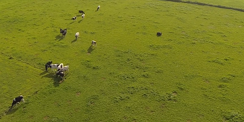

Verschoor Aerial Cow Dataset
============================

This folder contains the Verschoor Cow Aerial Dataset. It entails:
- The Makefile to download the videos.
- The annotations.
- The annotated videos.
- The original videos.

Usage
-----

1. Download the videos by executing the Makefile
2. Annotation files contain per column:
    1.  **Track ID:** All rows with the same ID belong to the same path.
    2.  **Xmin:** The top left x-coordinate of the bounding box.
    3.  **Ymin:** The top left y-coordinate of the bounding box.
    4.  **Xmax:** The bottom right x-coordinate of the bounding box.
    5.  **Ymax:** The bottom right y-coordinate of the bounding box.
    6.  **Frame:** The frame that this annotation represents.
    7.  **Lost** If 1, the annotation is outside of the view screen.
    8.  **Occluded** If 1, the annotation is occluded.
    9.  **Generated:** If 1, the annotation was automatically interpolated.
    10. **Label:** The label for this annotation, enclosed in quotation marks.

Creation
--------

- **Date:** August 28, 2013
- **Location:** Voorsterweg 31, 8316 PR Marknesse, The Netherlands
- **Pilot:** Christian Muller
- **Platform:** Ascending Technologies Pelican
- **Camera:** GoPro HERO 3: Black edition
- **Type:** Video
- **Quality:** 1080p
- **Field of view:** Medium (Vertical: 55° Horizontal: 94.4°)
- **Frames per second:** 60
- **Mount:** 3D printed made by Rob van Holstein.

Annotation
----------

- **Annotator:** Camiel R. Verschoor
- **Comments:** Only the parts containing cows were annotated.
- **Tool:** [Video Annotation Tool from Irvine, California](http://web.mit.edu/vondrick/vatic/). Vatic is a free, online, interactive video annotation tool for computer vision research that crowdsources work to Amazon's Mechanical Turk. The tool makes it easy to build massive, affordable video data sets and can be deployed on a cloud. After three years of research, vatic is now used by labs around the world to annotate the next generation of data sets. The tool contains:
    - A web interface.
    - Interfacing for Mechanical Turk.
    - Automatic interpolation between annotated frames.
    - Gold Standard Training for users for better results.
    - Outputs in various standards (ie. VOC PASCAL)

Videos
------

- **videos:**
    - COW809\_1.MP4
        - **Original video:** COW809.MP4
        - **Start:** 0:27
        - **End:** 1:55
    - COW809\_2.MP4
        - **Original video:** COW809.MP4
        - **Start:** 2:09
        - **End:** 2:27
    - COW809\_3.MP4
        - **Original video:** COW809.MP4
        - **Start:** 2:40
        - **End:** 3:20
    - COW809\_4.MP4
        - **Original video:** COW809.MP4
        - **Start:** 5:05
        - **End:** 6:11
    - COW810\_1.MP4
        - **Original video:** COW810.MP4
        - **Start:** 1:10
        - **End:** 1:55
    - COW810\_2.MP4
        - **Original video:** COW810.MP4
        - **Start:** 2:30
        - **End:** 3:20
- **original_videos:**
    - COW809.MP4
        - **Duration:** 6:48
        - **Type of platform:** Multirotor
        - **Field:** 1
    - COW810.MP4
        - **Duration:** 6:37
        - **Type of platform:** Multirotor
        - **Field:** 1
    - COW811.MP4
        - **Duration:** 8:40
        - **Type of platform:** Multirotor
        - **Field:** 1
    - COW813.MP4
        - **Duration:** 6:19
        - **Type of platform:** Fixed-wing
        - **Field:** 2
    - COW814.MP4
        - **Duration:** 4:57
        - **Type of platform:** Fixed-wing
        - **Field:** 2
    - COW815.MP4
        - **Duration:** 4:16
        - **Type of platform:** Fixed-wing
        - **Field:** 2
    - COW816.MP4
        - **Duration:** 9:31
        - **Type of platform:** Multirotor
        - **Field:** 2
